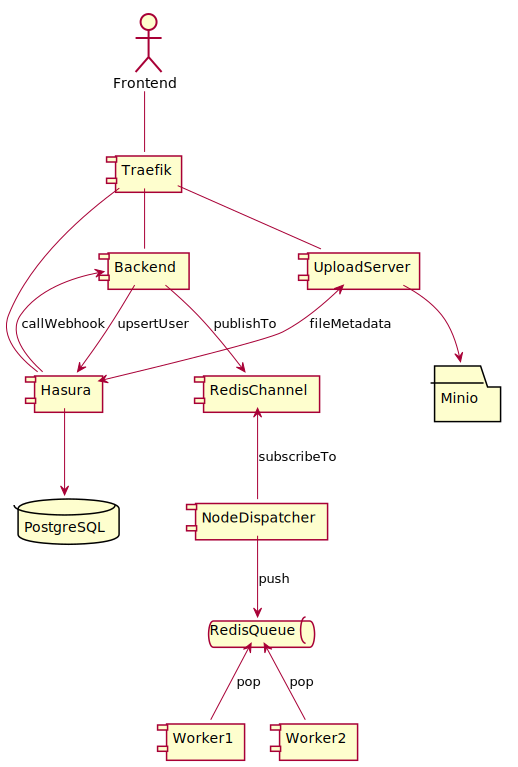

# eForm AGID - backend

## Funzionalità

Il backend del progetto eForm AGID implementa funzionalità quali:

- autenticazione di un utente generico tramite un codice inviato all'indirizzo email immesso
- autenticazione di un utente Responsabile per la Transizione Digitale (RTD) tramite un codice inviato all'indirizzo email trovato su [IPA](https://indicepa.gov.it)
- interfaccia GraphQL al database PostgreSQL (per salvare e leggere i contenuti provenienti dai form del frontend)
- logiche di business (_"rules"_) in reazione ad eventi del database (es. aggiornamento di un contenuto); sono attivate da un webhook
- invio delle email tramite un worker process (attivato dai messaggi che transitano in una coda FIFO)

Le componenti software principali sono scritte in Typescript e constano di:

- un [server express](../src/servers.ts) (NodeJS) che implementa le [logiche](../src/controllers/auth_ipa.ts) [di autenticazione](../src/controllers/auth_email.ts)
e un [webhook](../src/controllers/graphql_webhook.ts) per reagire alle modifiche dei dati su Hasura / PostgreSQL
- un server express (NodeJS) che implementa l'[upload dei file](../src/uploads/upload-server.ts) e
il download dei file caricati
- alcuni [worker NodeJS](../src/workers/) per il processamento asincrono



Nell'infrastruttura sono presenti inoltre:

- un server [PostgreSQL](https://www.postgresql.org/) per la persistenza dei dati
- un server [Hasura](https://hasura.io/) che agisce da proxy verso PostgreSQL convertendo le query GraphQL
- un server [Minio](https://min.io/) che implementa le API (compatibili con S3 Amazon) per l'upload dei file
- un server [Redis](https://redis.io/) per lo storage dei token di autenticazione (sessioni utente) 
e l'implementazione di una [coda FIFO](https://github.com/OptimalBits/bull) dove viene effettuato il dispatch dei messaggi
inviati dal webhook configurato su Hasura
- un proxy [Traefik](https://containo.us/traefik/) che permette l'accesso da internet ai diversi servizi docker
e automatizza l'utilizzo dei certificati TSL (per https)

## Tracker del progetto

Le attività (TODO) del progetto sono tracciate mediante [Pivotal Tracker](https://www.pivotaltracker.com):

- [Backend](https://www.pivotaltracker.com/n/projects/2325271)
- [Frontend](https://www.pivotaltracker.com/n/projects/2354762)
- [Backoffice](https://www.pivotaltracker.com/n/projects/2354770)

## Installazione in locale

```shell
git clone https://github.com/AgID/agid-forms-backend
cp env.example .env # editare il file
docker-compose up -f docker-compose.yml -f docker-compose.override.dev.yml -d --build
```

Le variabili del file di configurazione sono documentate
nel file di esempio [env.example](../env.example).

## Accesso alla console Hasura

Per poter gestire i dati sul database, è possibile
accedere localmente alla [console di Hasura](https://docs.hasura.io/1.0/graphql/manual/hasura-cli/hasura_console.html).

A tal fine è necessario scaricare il binario e impostare il secret in un file
[`database/config.yaml`](../database/config.yaml):

```yaml
admin_secret: <HASURA ADMIN SECRET>
endpoint: https://localhost:<HASURA LOCAL PORT>/
# endpoint: https://database.form.agid.gov.it/
```

dopodiché sarà possibile lanciare l'applicazione web:

```shell
$ cd database
$ hasura console
INFO hasura cli is up to date                      version=1.0.0-rc.1
INFO console running at: http://localhost:9695/
```

Per caricare la configurazione su Hasura:

```shell
$ cd database
$ hasura console migrate
```

## Modello dati

### Tabelle SQL

`ipa_ou`: dati sulle unità organizzative [importati da IPA](../scripts/ipa-import.sh)
`ipa_pa`: dati sulle pubbliche amministrazioni [importati da IPA](../scripts/ipa-import.sh)

`group`: i nomi dei gruppi ai quali può appartenere un utente
`language`: tabella di lookup con i possibili identificativi degli idiomi usati per le traduzioni dei contenuti
`last_published_or_draft`: vista (view sql) che elenca l'ultima bozza di un nodo _o_, se presente, la sua ultima versione pubblicata
`node`: nodi con il loro contenuto (content::jsonb)
`node_revision`: revisioni dei nodi
`node_type`: tabella di lookup con l'elenco dei possibili tipi di nodo (1-a-1 con i form del frontend)
`node_type_perm`: associazione di un nodo con i permessi (es. insert) per singolo ruolo
`role`: tabella di lookup con i nomi dei ruoli utente
`status`: tabella di lookup con gli stati di un nodo per il workflow di pubblicazione
`user`: utenti del sistema che hanno effettuato almeno un login
`user_group`: tabella di associazione utenti / gruppi

### Nodi e autorizzazioni

I contenuti sono salvati nel sistema nella tabella `node`. Oltre ai metadati
(es. data di creazione / modifica, utente che ha creato il nodo, ...) viene salvato
il contenuto in forma destrutturata (_schemaless_) in un campo [JSONB](https://www.postgresql.org/docs/9.5/functions-json.html).

Cioè permette di gestire programmaticamente i contenuti di un nodo tramite query GraphQL
grazie al [meccanismo di traduzione delle query implementato da Hasura](https://blog.hasura.io/postgres-json-and-jsonb-type-support-on-graphql-41f586e47536/).

A ogni salvataggio di un nodo viene creata una entry con il contenuto salvato nella tabella `node_revision`
tramite una _stored procedure_ PostegreSQL, in maniera quindi trasparente all'applicazione. In questo
modo è possibile conservare e reperire tutte le vecchie versioni di un certo contenuto.

I permessi (CRUD) sui nodi sono assegnati tramite la console di Hasura; vengono salvati automaticamente
nei file di configurazione contenuti nella directory [../database/migrations/*_init](../database/migrations/)
quando si lancia la console dalla directory `database`.

Per approfondire: https://docs.hasura.io/1.0/graphql/manual/auth/authorization/index.html

Attualmente i permessi sui nodi sono impostati in modo da garantire che:

- solo gli utenti autenticati possono effettuare insert sul database (al momento non è quindi possibile avere dei form "anonimi")
- per poter effettuare una insert deve esistere una entry nella tabella `node_type_perm`
che associa il ruolo dell'utente autenticato al permesso corrispondente (es. `insert`) sulla tabella `node`
- solo gli utenti che hanno creato un nodo possono aggiornarlo (_update_)
- gli utenti anonimi possono visualizzare solo i nodi con `status = published`
- gli utenti autenticati possono visualizzare tutti i contenuti da loro creati oltre ai nodi con `status = published`
- gli stessi permessi si applicano alla tabella `node_revision` (non è pertanto possibile al momento nascondere
una vecchia revisione pubblicata)

## API di autenticazione

Le API di autenticazione sono descritte nel file [`api_backend.yaml`](../api_backend.yaml):

https://redocly.github.io/redoc/?url=https://raw.githubusercontent.com/AgID/agid-forms-backend/master/api_backend.yaml

## Processi asincroni

Per qualsiasi necessità di scrivere o leggere dati, il frontend
contatta direttamente Hasura passando il token (JWT) ottenuto tramite le API di autenticazione.

Sul server Hasura è configurato un [event trigger](https://docs.hasura.io/1.0/graphql/manual/event-triggers/index.html)
in modo tale che, per ogni evento di modifica di un nodo nel database, Hasura invia il contenuto 
del nodo verso un endpoint (webhook) configurato tramite il backoffice.

Il processo express/NodeJS (lo stesso che implementa le API di autenticazione) riceve il payload del webhook
tramite uno [specifico endpoint](../src/controllers/graphql_webhook.ts) che pubblica l'evento (e il payload)
su uno specifico [canale Redis](https://redis.io/topics/pubsub).

Un altro [processo NodeJS](../src/workers/node_events_dispatcher.ts), in ascolto su tale canale (subscribe),
processa il messaggio ricevuto e ne effettua il _dispatching_ su una specifica coda FIFO ([Redis Bull Queue](https://github.com/OptimalBits/bull))
indirizzandolo verso un "worker process" che riceve i messaggi dalla coda.

In tal modo viene disaccoppiato l'evento (scrittura / aggiornamento di un dato) dalla logica business
che ne consegue.

Al momento i _worker process_ attivi sono:

- [verifica dei link della dichiarazione di accessibilità](../src/workers/link_verifier_processor.ts)
- [invio di email](../src/workers/email_processor.ts)

## Deploy in produzione

La macchina in produzione deve essere opportunamente configurata;
a tal fine il repository contiene un file [`rc.local`](../docker/compose/rc.local)
che riporta:

- le modifiche da effettuare ai parametri di sistema
- i `cron jobs` da installare per il [backup del database](../scripts/backup-db.sh)
e l'importazione dei dati da [IPA](https://indicepa.gov.it).

```shell
cd /home/ubuntu/agid-forms-backend
git pull origin master # aggiorna all'ultima versione pubblicata su GitHub
docker-compose up -d --build
```
